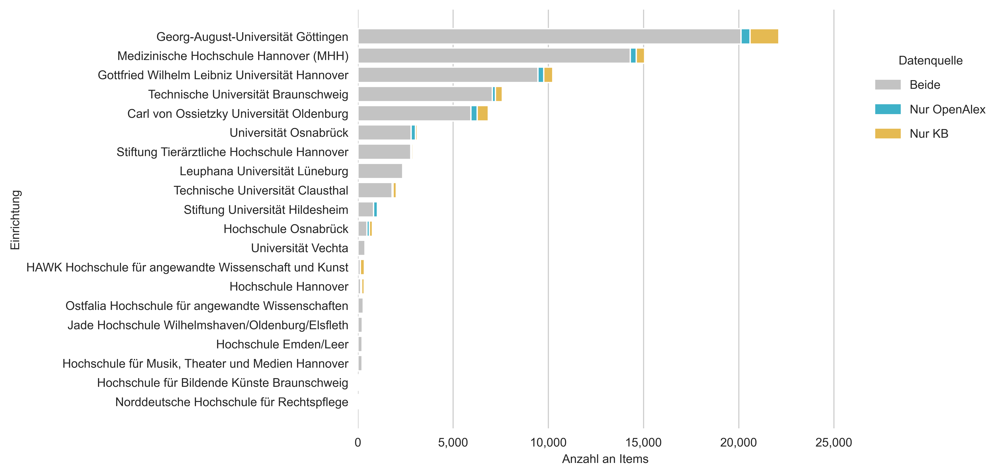

# HDN-FIS: Institutionsanreicherung niedersächsischer Hochschulen in OpenAlex

**🚧 Work in progress! 🚧**

Dieses Projekt zielt darauf ab, die Abdeckung niedersächsischer Hochschulen in OpenAlex zu optimieren. 

### 🏗️ Problem

Nicht immer ist eine korrekte Zuordnung einer Person zu einer (deutschen) wissenschaftlichen Einrichtung in bibliographischen Datenquellen (z.B. OpenAlex) gegeben.

<b>Beispiel:</b>

```json
{
      "author_position": "middle",
      "author": {
        "id": "https://openalex.org/A5057081490",
        "display_name": "Thorsten R. Doeppner",
        "orcid": "https://orcid.org/0000-0002-1222-9211"
      },
      "institutions": [
        
      ],
      "countries": [
        
      ],
      "is_corresponding": false,
      "raw_author_name": "Thorsten R. Doeppner",
      "raw_affiliation_strings": [
        "Department of Neurology, University Medical Center Goettingen, Goettingen, 37075, Germany"
      ],
      "affiliations": [
        {
          "raw_affiliation_string": "Department of Neurology, University Medical Center Goettingen, Goettingen, 37075, Germany",
          "institution_ids": [
            
          ]
        }
      ]
}
```

<b>Idee:</b> Anhand von Instititutionszuordnungen aus anderen offenen Datenquellen könnten Lücken geschlossen werden und ggf. fehlerhafte Zuordnungen korrigiert werden. 

## 📈 Daten

- [GERiT](https://gerit.org/de/service): Stand Januar 2025
- [OpenAlex](https://openalex.org): Stand Juni 2026
- [Kompetenznetzwerk Bibliometrie (KB)](https://bibliometrie.info): Stand März 2026

### Öffentliche Hochschulen in Niedersachsen

| Einrichtung | GERiT ID | ROR ID | Sektor | Bundesland |
|-------------|----------|--------|--------|------------|
| Leuphana Universität Lüneburg | 10232 | https://ror.org/02w2y2t16 | uni | Niedersachsen
| Carl von Ossietzky Universität Oldenburg | 10233 | https://ror.org/033n9gh91 | uni	| Niedersachsen |
| Jade Hochschule Wilhelmshaven/Oldenburg/Elsfleth | 10533 | https://ror.org/02vvvm705 | fh | Niedersachsen |
| Hochschule Emden/Leer | 980710 | https://ror.org/01bc76c69 | fh |	Niedersachsen |
| Gottfried Wilhelm Leibniz Universität Hannover | 10238 | https://ror.org/0304hq317 |	uni | Niedersachsen |
| Hochschule für Musik, Theater und Medien Hannover | 10246 | https://ror.org/00x67m532 | khmh |	Niedersachsen |
| Hochschule Hannover |	10252 |	https://ror.org/03m2kj587 |	fh | Niedersachsen |
| Stiftung Tierärztliche Hochschule Hannover | 10249 | https://ror.org/015qjqf64 | uni | Niedersachsen |
| Medizinische Hochschule Hannover (MHH) | 10247 | https://ror.org/00f2yqf98 | uni |	Niedersachsen |
| HAWK Hochschule für angewandte Wissenschaft und Kunst |	10253 |	https://ror.org/00f5q5839 |	fh | Niedersachsen |
| Stiftung Universität Hildesheim |	10235 |	https://ror.org/02f9det96 |	uni | Niedersachsen |
| Georg-August-Universität Göttingen | 10236 | https://ror.org/01y9bpm73 | uni | Niedersachsen |
| Technische Universität Braunschweig |	10240 |	https://ror.org/010nsgg66 |	uni	| Niedersachsen |
| Hochschule für Bildende Künste Braunschweig |	10251 |	https://ror.org/03aft2f80 |	khmh | Niedersachsen |
| Ostfalia Hochschule für angewandte Wissenschaften | 10254 |	 https://ror.org/01bk10867 |	fh | Niedersachsen |
| Technische Universität Clausthal | 10242 | https://ror.org/04qb8nc58 | uni	 | Niedersachsen | 
| Universität Osnabrück | 10244 | https://ror.org/04qmmjx98 | uni |	Niedersachsen |
| Hochschule Osnabrück | 10255 | https://ror.org/059vymd37 | fh | Niedersachsen |
| Universität Vechta | 10597 | https://ror.org/045y6d111 | uni | Niedersachsen |
| Norddeutsche Hochschule für Rechtspflege | | https://ror.org/02743t710 | fh | Niedersachsen |
| Universitätsmedizin Göttingen | | https://ror.org/021ft0n22 | uni | Niedersachsen |

<b>Tab. 1.</b> Bedeutung der Abkürzungen: uni = Universität, fh = Hochschule, khmh = Kunst- und Musikhochschule

### Suborganisationen in OpenAlex (ohne An-Institute)

#### Georg-August-Universität Göttingen
- Gesellschaft für wissenschaftliche Datenverarbeitung mbH Göttingen: https://ror.org/00cd95c65
- Göttingen Campus Institut für Dynamic biologischer Netzwerke: https://ror.org/02f04tm31
- Campus-Institut Data Science (CIDAS): https://ror.org/044sxzm68
- Niedersächsische Staats-und Universitätsbibliothek Göttingen: https://ror.org/05745n787

#### Universitätsmedizin Göttingen
- Else Kröner Fresenius Zentrum für Optogenetische Therapien: https://ror.org/03vwt8p73

#### Gottfried Wilhelm Leibniz Universität Hannover 
- Forschungszentrum L3S: https://ror.org/039t4wk02
- Forschungszentrum Küste (FZK): https://ror.org/00w53fs94

#### Carl von Ossietzky Universität Oldenburg (plus UMO)
- Institut für Ökonomische Bildung: https://ror.org/025t8vx68
- Institut für Chemie und Biologie des Meeres: https://ror.org/0060pja03
- Klinikum Oldenburg: https://ror.org/01t0n2c80 (UMO)
- Evangelisches Krankenhaus Oldenburg: https://ror.org/04830hf15 (UMO)
- Pius Hospital Oldenburg: https://ror.org/03avbdx23 (UMO)
- Helmholtz-Institut für Funktionelle Marine Biodiversität: https://ror.org/00tea5y39

## Methode

### 🏫 Download Institutionsdaten

Um eine Liste mit allen wissenschaftlichen Institutionen in Niedersachsen (und Deutschland) zu erhalten, wurden zunächst sämtliche Stammdaten aus dem GERiT-Verzeichnis heruntergeladen. Die einzelnen Institutionen wurden dann auf Basis der Postleitzahl mit einem Bundesland verknüpft (siehe [Python-Skript](get_institutions.py)). Es wurden manuell Zuordnungen erstellt, sofern eine Postleitzahl nicht mit einem Bundesland verknüpft werden konnte. Die komplette Liste mit wissenschaftlichen Einrichtungen kann im Ordner [data/](data/inst_with_federal_state_filled.csv) heruntergeladen werden. Die Liste kann genutzt werden, um Einrichtungen nach ihren Bundesländern zu filtern.

### 🖇️ Verknüpfung der Institutionsdaten mit weiteren Datenquellen

Im nächsten Schritt wurden die Institutionsdaten mit Daten aus OpenAlex und dem KB angereichert. So ist es möglich, Institutionen nach dem Bundesland Niedersachsen zu filtern und nur Institutionen zu berücksichtigen, die im KB als Hochschule klassifiziert werden. Es folgt ein Vergleich der Institutionszuordnung in OpenAlex und dem KB.

## 🔎 Gap-Analyse

<figure>
    
    <figcaption>
        <b>Fig.1:</b> Vergleich der Zuordnung von Affiliationsstrings mit niedersächsischen Hochschulen in OpenAlex und KB. Es wurde jede Hochschule pro Publikation nur einmal gezählt. Nur Zeitschriftenartikel zwischen 2020 und 2024 wurden berücksichtigt. Publikationen der Universitätsmedizin Göttingen wurde aus Gründen der besseren Vergleichbarkeit zwischen den Datenquellen der Universität Göttingen zugerechnet. Gleiches gilt auch für Publikationen der Universitätsmedizin Oldenburg, welche der Universität Oldenburg zugerechnet wurden. 
    </figcaption>
</figure>

## 🔨 Anreicherung in OpenAlex

Mithilfe des Datenabgleichs aus OpenAlex und dem KB lassen sich konkrete Verbesserungsvorschläge bei der Institutionszuordnung in OpenAlex ableiten. Diese können in der folgenden Tabelle eingesehen werden.

- [Link](https://naustica.github.io/lower_saxony_institutions/download) (Demo)

## 🗂️ Fakultätszuordnung mit GERiT

Ziel dieses Arbeitspaketes ist es, die Affilitationsangaben in OpenAlex mit GERiT zu verknüpfen, sodass Publikationen einer Fakultät oder einem Institut zugeordnet werden können. Die Zuordnung erfolgt auf Basis von regulären Ausdrücken sowie Mustererkennung.

<b>Beispiel:</b>

```json
{
    "doi": "10.1186/s12904-020-00573-6",
    "raw_affiliation_string": "Psychology of Language Department, University of Göttingen , Göttingen 37073, Germany",
    "parent_name": "Georg-August-Universität Göttingen",
    "parent_id": "https://gerit.org/de/institutiondetail/10236",
    "faculty": "Fakultät für Biologie und Psychologie",
    "faculty_id": "https://gerit.org/de/institutiondetail/13697",
    "department": "Georg-Elias-Müller-Institut für Psychologie",
    "department_id": "https://gerit.org/de/institutiondetail/16816",
    "institute": "Abteilung der Psychologie der Sprache",
    "institute_id": "https://gerit.org/de/institutiondetail/560902828",
    "author": {
        "id": "https://openalex.org/A5012202437",
        "display_name": "Rajalakshmi Madhavan",
        "orcid": "https://orcid.org/0000-0002-0830-563X"
    }
}
```

## 📫 Kontakt

Nick Haupka, Staats- und Universitätsbibliothek Göttingen. nick.haupka@sub.uni-goettingen.de
Nataliia Kaliuzhna, Technische Informationsbibliothek Hannover. nataliia.kaliuzhna@tib.eu
